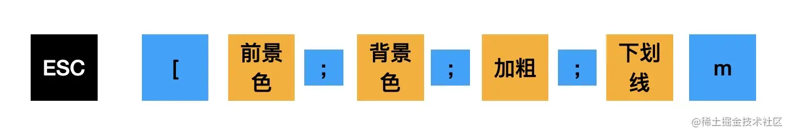

# 参考
- 《用户手册》 https://github.com/jamiebuilds/babel-handbook/blob/master/translations/zh-Hans/user-handbook.md
- 《插件手册》 https://github.com/jamiebuilds/babel-handbook/blob/master/translations/zh-Hans/plugin-handbook.md

# JS Parser 历史
- Mozilla发布最早的JS parser -- esprima，基于SpiderMonkey的AST标准，后来形成estree标准【https://github.com/estree/estree/blob/master/es5.md】
- acorn基于estree标准，速度更快，支持通过插件实现语法支持
- eslint的parser -- espree 以及 babel的 parser都是基于 acorn
- 从babel4以后，babel fork了acorn来修改，不再依赖acorn，但原理相似


# API
## AST 别名（Aliases）
- 参考 node_modules/@babel/types/lib/index.d.ts 的 interface Aliases ，可以看到Aliases所包含的AST类型


## generator
- 了解如何构建各类ast节点 https://github.com/babel/babel/tree/main/packages/babel-generator/src/generators 
- 生产sourcemap以来npm包 source-map
```json
{
　　version : 3,
   file: "out.js", // 转换后的文件名
   sourceRoot : "", // 转换前文件所在目录，为空表示转换前的文件在同一目录
   sources: ["foo.js", "bar.js"], // 源文件，多个标识合并成1个目标文件
   names: ["src", "maps", "are", "fun"], // 转换前的所有变量名和属性名，以便让下面的mapping直接引用，减少体积
   mappings: "AAgBC,SAAQ,CAAEA"
}
```
- mappings属性：每个分号表示1行，通过逗号`,`分割

## 其他
- state.opt 也可以获取options


# 控制台打印错误

- 使用 @babel/highlight 完成高亮代码
- chalk完成打印颜色
  - 
  - 例： `echo -e "\033[36;1;4mguang"`

# babel插件 、 babel preset
- 两种格式，1.返回对象（可以从参数获取babel api--如template、types 而不需要自行import）， 2.返回对象
- 先应用plugin，再应用preset
- plugin从前到后，preset从后到前
- babel名字补齐：
  - 相对路径、绝对路径都不补齐
  - aa => babel-plugin-aa
  - @scope/aa => @scope/babel-plugin-aa
  - @babel/aa => @babel/plugin-aa
- env preset 包含的插件： https://github.com/babel/babel-preset-env/blob/master/data/plugin-features.js
- 


# 单测
- 使用 babel-plugin-tester
```js
import pluginTester from 'babel-plugin-tester';
import xxxPlugin from '../xxx-plugin';

pluginTester({
  plugin: xxxPlugin,
  fixtures: path.join(__dirname, '__fixtures__'), // 保存测试点的地方
  tests: {
    'case1:xxxxxx': '"hello";', // 输入输出都是同个字符串
    'case2:xxxxxx': { // 指定输入输出的字符串
      code: 'var hello = "hi";',
      output: 'var olleh = "hi";',
    },
    'case3:xxxxxx': { // 指定输入输出的文件，和真实输出对比
      fixture: 'changed.js',
      outputFixture: 'changed-output.js',
    },
    'case4:xxxxxx': { // 指定输入字符串，输出到快照文件中，对比测试
      code: `
        function sayHi(person) {
          return 'Hello ' + person + '!'
        }
      `,
      snapshot: true,
    },
  },
});
```
